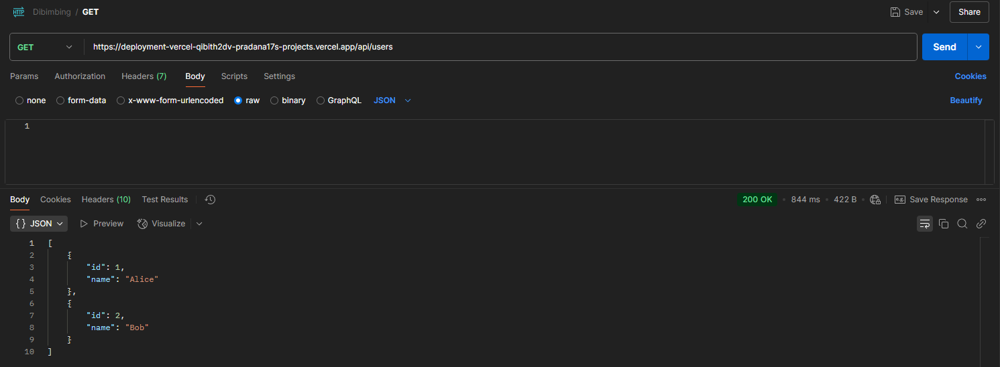
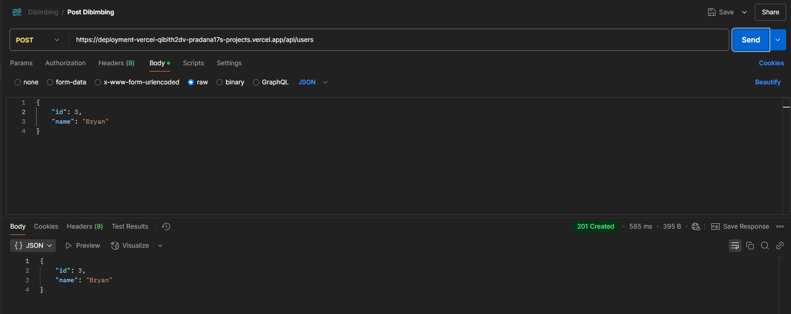
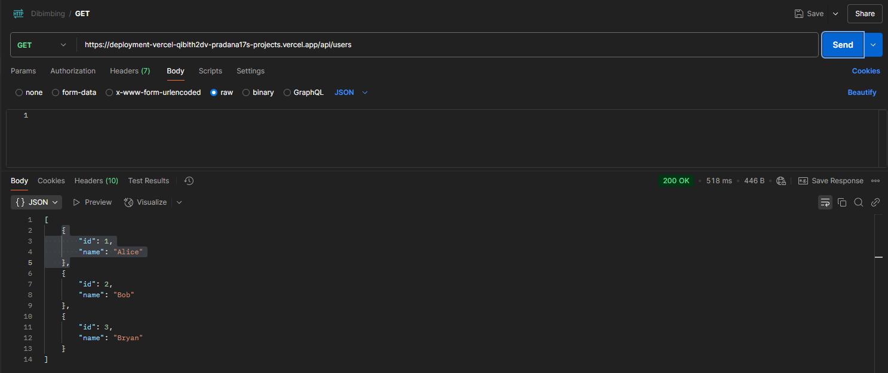

# Go API Deployment on Vercel

## Cara Menjalankan API di Vercel

1. **Pastikan Vercel CLI telah terinstall:**
   ```sh
   npm install -g vercel
   ```

2. **Login ke akun Vercel:**
   ```sh
   vercel login
   ```

3. **Deploy API ke Vercel:**
   ```sh
   vercel
   ```

4. **Deploy ke produksi (opsional):**
   ```sh
   vercel --prod
   ```

5. **Cek URL hasil deployment yang diberikan oleh Vercel.**

---

## Endpoint API
- **GET /api/users** → Mengembalikan daftar pengguna statis.
- **POST /api/users** → Menambahkan pengguna baru ke dalam array sementara.

---

## Hasil Deploy
URL API:
[https://deployment-vercel-qibith2dv-pradana17s-projects.vercel.app/](https://deployment-vercel-qibith2dv-pradana17s-projects.vercel.app/api/users)

---

## Hasil Pengujian (Postman)
### 1. GET /api/users


### 2. POST /api/users

